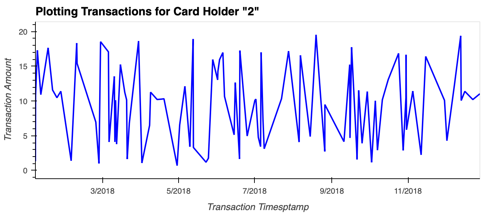

# Visual-Data-Analysis-of-Fraudulent-Transactions
Challenge / Project from Fintech Bootcamp for SQL Week

## Data Modeling: QuickDatabaseDiagrams

* [SQL Statements: Data Modelling.sql](QuickDBD-exports/QuickDBD-export.sql)
* [PDF: Data Modelling](QuickDBD-exports/QuickDBD-export.pdf)

## Output Analysis Images

### Data Analysis Question 1

|  Fig 1 | Fig 2  | Fig 3  |
|---|---|---|
|   |   |   |

## Jupyter Notebooks
[visual_data_analysis.ipynb](visual_data_analysis.ipynb)

## SQL Statements
* [SQL Statements: Datamodelling.sql](QuickDBD-exports/QuickDBD-export.sql)
* [SQL Statements: Data_Analysis_Question_1.sql](SQL/Data_Analysis_Question_1.sql)

## Instructions
[Instructions.md](Instructions.md)
